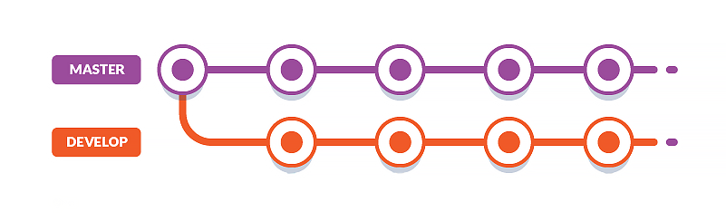
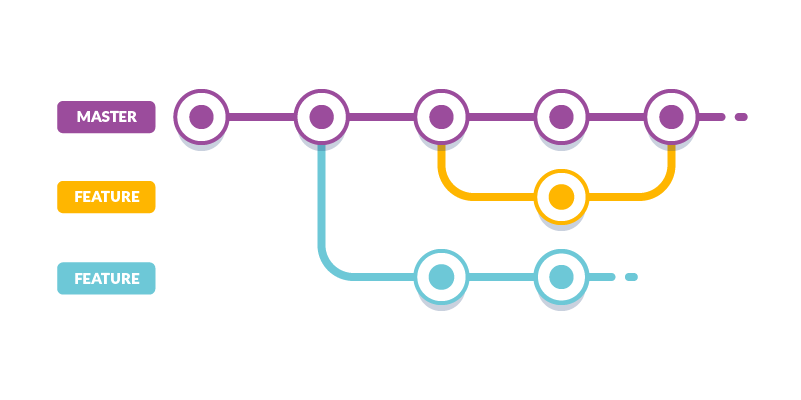
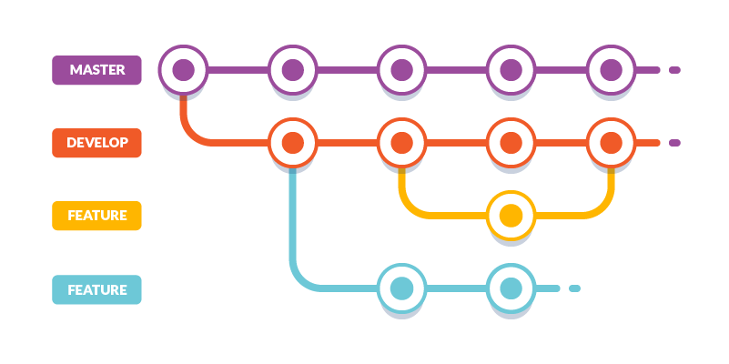

# Organize Project Code
The focus for this article is to learn how to create various branch strategies we can use.

## 1. Zero Branch Strategy

The Zero Branch Strategy is simply a fancy way of saying “you are not using any branch strategy.” It’s also known as a basic workflow. You only have a master branch where you directly commit and build your releases. 
##### This strategy is convenient and good if the project is:
- Small and simple
- Hardly requires updates
- Managed by a solo developer

Such projects include tutorials, demos, prototypes, starter project templates and personal projects. However, there are several cons to this approach:
- Multiple merge conflicts will likely occur if more than one person is working on the project
- You won’t be able to develop multiple features and fix issues concurrently
- Removing and restoring features will be a difficult task
- Your team will spend too much time dealing with version control issues instead of working on new features

All these issues can be resolved by adopting a branch strategy.
##### This should give you:

- Ability to work independently and push changes to the shared repository without affecting your team members
- Ability to merge your teammates’ code with your changes and quickly resolve any conflicts that may come up
- Assurance that code standards are maintained and collaboration efforts run smoothly regardless of the size of your team

Do note that there are many types of branch workflows you are free to pick. You can also create your own custom branch workflow that works best for you. 

Let’s start with the simplest branch strategy.

## 2.  Develop Branch Strategy

In this strategy, you set up a long-living branch called develop that runs alongside the master branch. All work is committed first to the develop branch. This is a safe place where you can introduce new code that might break your project. You’ll need a testing strategy in place in order to ensure that you don’t introduce bugs to the master branch when you merge the changes.
##### The pros of this workflow are:
- Simple to implement
- The master branch remains stable and healthy as long as experimental work is done on the develop branch
- A hotfix can be implemented at any time on the master branch while a feature is currently being implemented

##### Cons of this workflow are:
- Multiple features can’t be developed concurrently
- Only one developer (max two) can actively work on the project
- Removing and restoring features using just the develop branch is a challenge

Let’s look at another workflow that could mitigate these challenges.

## 3. Feature Branch Strategy

In this workflow, you setup a new feature branch every time you want to develop a new feature. You can apply a hotfix at anytime on the master branch in case a problem arises. Developers will need to pull in the latest fixes from the master branch first before they can merge their feature branch into master.

You will need a naming convention for your branches in order to track features and bug fixes that are currently under development. Here are some of the format suggestions you can find on the internet:
- users/username/description
- users/username/workitem
- bugfix/description
- features/feature-name
- features/feature-area/feature-name
- features/id (the ‘id’ is generated by a project management tool)
- hotfix/description

##### The pros of this strategy are:
- You can have large number of developers on your project working on multiple features concurrently
- It’s easy to remove features and restore them later if you change your mind
- You can easily track what each developer is working on
##### The cons of this strategy are:
- Developing features concurrently is not always feasible for situations where implementing a feature is dependent on another feature yet to be developed. This means the features can’t be pushed to the master until all dependent features are complete

Let’s look at the next strategy and see how we can mitigate this problem.

## 4. Gitflow Branch Strategy

If you can combine the “Develop” and “Feature” branch workflows, you get a solution that cancels each other’s cons. [Vincent Driessen](https://nvie.com/posts/a-successful-git-branching-model/) wrote a blog post where he describes an advance git branching model that helps large teams collaborate efficiently on complex projects with minimal version control issues.

Gitflow is a customizable model that allows you to pick the features that will work best for your project and your team. If you are using Gitflow, you can adopt [Daniel Kummer’s](https://danielkummer.github.io/git-flow-cheatsheet/) git-flow git extensions. These are tools that allow developers execute high-level repository operations based on Vincent’s model. I won’t go much into this but here is what you need to know.
##### Pros:
- Suitable for large teams working on a complex project
- Easy to track active features and organize releases
##### Cons:
- Overkill for small projects

----
- [gitflow-workflow](https://www.atlassian.com/git/tutorials/comparing-workflows)

- This article was created in partnership with [Buddy](https://buddy.works).